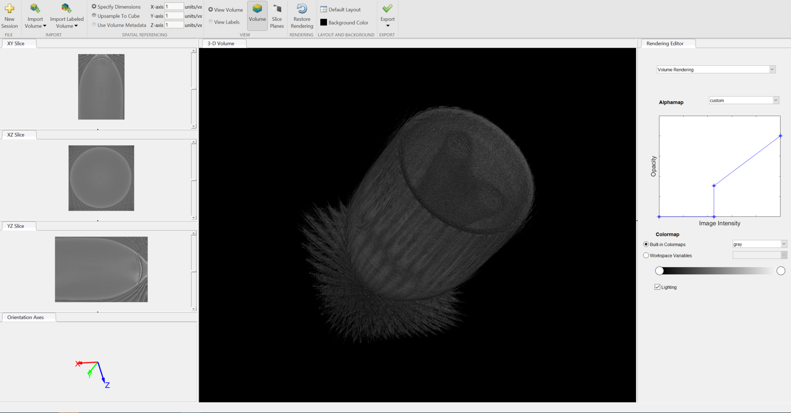

The following project illustrates how the Inverse Radon Transform function can be utilized by using 2D shadowgrams of an object to obtain cross sections at different layers/heights which can be stacked on top of one another to create 3D rendering of the object.

Shadowgrams: These are projections/shadow of the object on a white screen. The ideal light source for this experiement would emit parallel beams or light sheets. Due to lack of adequate laboratory instrument given COVID-19, an LED screen was used as both light source and screen/background to obtain images of the object that resemble shadowgrams. A total of 33 projection mages were taken by rotating the object on a fixed axis by ~ 11 degrees each time. 

Shadowgrams of object(2 pencils) in clear liquid:

Rotation: 0 degrees

Rotation: 11 degrees

Rotation: 254 degrees

Algorithm:
-> To obtain cross section of the object at a certain height, a given row (for example 200th row in a 500x500 image: resulting size 1x500) is extracted from all 33 projections. These rows are stored as a separate matrix (resulting size: 33x500). The Inverse Radon Function take the transpose of this resulting matrix and the intervals of rotation as input parameters to output the cross sections at that height. 

IR = iradon(single_layer_t, theta);      where, single_layer_t is the 500x30 array
                                                theta = 0:11:360

Sample cross-sections of object in clear liquid obtained via iradon transform can be seen below:

-> Desity of each object is also taken into account with the help of absorbance. This is reflected in the object's projections. For example, when the objects are kept in murky liquid (instead of clear), less light passes through the liquid. This results in a decrease in the object's contrast in the shadowgrams. 

Shadowgrams of object in murky liquid:

Rotation: 0 degrees

Rotation: 11 degrees

Rotation: 254 degrees

Sample cross-sections of object in murky liquid obtained via iradon transform can be seen below:

In the code.m file, the cross-sections of all layers of the object in files 'Pencils_clear-water' and 'pencils_murky_water' are obtained and stacked on one other to create a 3D rendering of the object. MATLAB volume rendering tool is then used to view the 3D rendering of the object by changing opacity and intensity values. 

3D renderings of object in clear liquid: Shape of the object can be easily seen without drastically changing opacity and intensity values

3D renderings of object in murky liquid: Shape of the object cannot be easily seen and requires appropriate adjustment of opacity and intensity values.

 
