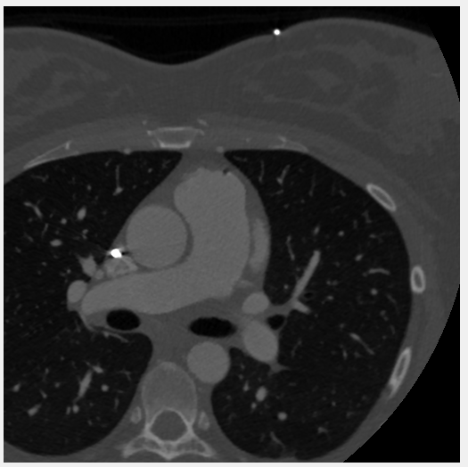
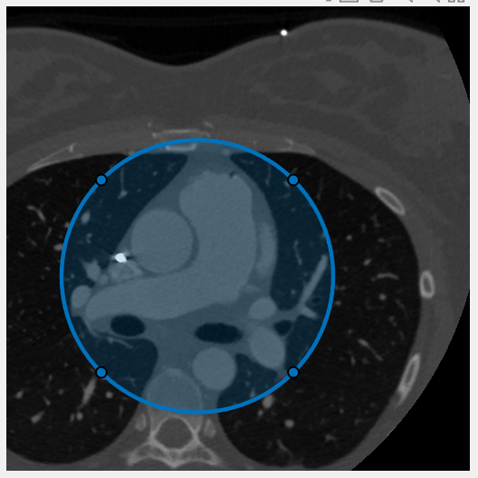
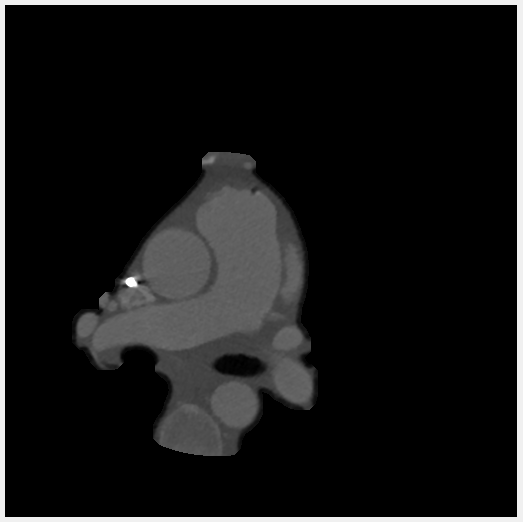

This program let's the user read in a file containing DICOM series images of chest CT scans and isolate the heart from the rest of the image. 

Working concept: The user selects a sample of images from the dataset to create circular ROIs around the heart with help to predict how the position and size of the heart are changing from current layer to the next layer using a third degree polynomial regression model.  

File(s) included: main.m, read_dicom_data.m, create_model.m

read_dicom_data.m:

*** This function allows the user to enter a filename containing DICOM series images and upload the files for segmentation. A certain sample size is to be selected from the total number of images for drawing circular ROI. The program records the center and radius of each ROI drawn for samples. The user can split the samples into multiple batches. ***

create_model.m:

The data obtained fom read_dicom_data.m is used by this function to create a third degree polynomial model to predict how the center and radius chnage for each scan in the data. This model is used to create circular binary masks for each scan in the series.

main.m:

Binary masks created for each image using the polynomial model are utilized by the active contours function to draw contours around the edges of the heart. Prior to applying active contours, a copy of the image is made which undergoes histogram rqualization, is passed through an averaging filter of size 5 followed by opening to remove background noise. The final mask is applied to the original image and saved as a new DICOM series image. 

Original Image

Drawing ROI

Final Image

